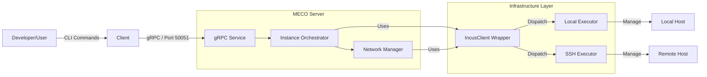

# Developers' Manual

A comprehensive guide for contributing to and extending the MECO emulator system.

---

## Table of Contents

1. [Introduction](#introduction)
2. [Getting Started](#getting-started)
3. [System Architecture](#system-architecture)
4. [Project Structure](#project-structure)
5. [Core Concepts](#core-concepts)
6. [Development Workflow](#development-workflow)
7. [How-To Guides](#how-to-guides)
8. [Debugging & Troubleshooting](#debugging--troubleshooting)
9. [Release & Contribution](#release--contribution)

---

## 1. Introduction <a id="introduction"></a>

The **MEga COnstellation Emulator (MECO)** is designed to simulate large-scale Low Earth Orbit (LEO) satellite networks. For developers, the project's core goals are:

- **Modularity**: Separation of concerns between the gRPC interface, core emulation logic, and infrastructure management.
- **Scalability**: Supporting hundreds of nodes by distributing workloads across multiple hypervisors.
- **Abstraction**: Hiding the complexity of disparate execution environments (containers, VMs, remote hosts) behind a unified API.

This guide will help you understand the internal mechanics of MECO so you can fix bugs, add features, or adapt it to new research needs.

---

## 2. Getting Started <a id="getting-started"></a>

### Prerequisites

| Component | Requirement | Notes |
| :--- | :--- | :--- |
| **OS** | Ubuntu 22.04+ | 24.04+ Recommended for native Incus support. |
| **Python** | 3.10+ | Core language for Server and Client. |
| **Incus** | 6.x+ | Application container & VM manager. |
| **QEMU** | `qemu-system` | Required if running Virtual Machines. |

### Environment Setup

#### 1. Clone the Repository

```bash
git clone https://github.com/netgroup/meco-devel.git
cd meco-devel
```

#### 2. Set up Python Environment

It is highly recommended to use a virtual environment:

```bash
python3 -m venv venv
source venv/bin/activate
```

#### 3. Install Dependencies

Install the package in **editable mode** (`-e`). This allows changes in `src/` to be immediately reflected without re-installing.

```bash
pip install -r requirements.txt
pip install -e .
pip install pytest black ruff grpcio-tools  # Dev tools
```

#### 4. Configure Local Incus

Ensure your user is part of the `incus-admin` group and Incus is initialized:

```bash
# Check group membership
groups | grep incus-admin

# Initialize if needed (default settings are usually fine)
incus admin init
```

#### 5. Verify Setup

Run a quick test to ensure the environment is healthy:

```bash
pytest tests/test_cli.py -v
```

---

## 3. System Architecture <a id="system-architecture"></a>

MECO follows a client-server architecture where a lightweight CLI client controls a persistent background daemon (Server).

### High-Level Diagram



### Key Components

1.  **Server (`meco-daemon`)**:
    -   Single-threaded control loop for safety.
    -   Manages the lifecycle of the emulation.
    -   Validates topologies before deployment.

2.  **Client (`meco-client`)**:
    -   A thin wrapper around gRPC stubs.
    -   Handles file uploads and user interaction.

3.  **Infrastructure Layer**:
    -   **Executor Pattern**: Abstracts *where* a command runs (`LocalExecutor` vs `SshExecutor`).
    -   **IncusClient**: A python wrapper that translates high-level requests (e.g., "launch node") into Incus CLI commands.

4.  **Networking**:
    -   Uses Open vSwitch (OVS) for wiring nodes.
    -   **`br-int`**: Integration bridge for local connections.
    -   **`br-tun`**: VXLAN tunnel bridge for cross-hypervisor communication.

---

## 4. Project Structure <a id="project-structure"></a>

The codebase is organized as a standard Python package in `src/meco`.

| Path | Description |
| :--- | :--- |
| **`src/meco/`** | **Package Root** |
| `├── main.py` | Server entry point & signal handling. |
| `├── client.py` | Client CLI logic. |
| `├── meco.proto` | gRPC service definition. |
| **`src/meco/emulation/`** | **Core Logic** |
| `├── lifecycle.py` | The "brain" managing start/stop sequences. |
| `├── generator.py` | Generates cloud-init configs for nodes. |
| **`src/meco/network/`** | **Networking** |
| `├── manager.py` | OVS bridge & flow rule management. |
| **`src/meco/infra/`** | **Hardware Abstraction** |
| `├── client.py` | `IncusClient` wrapper class. |
| `├── executors.py` | `LocalExecutor` and `SshExecutor` classes. |
| **`src/meco/service/`** | **API Layer** |
| `├── server.py` | Implementation of the gRPC `MecoService`. |
| **`src/meco/config/`** | **Configuration** |
| `├── loader.py` | YAML loading and schema validation. |

---

## 5. Core Concepts <a id="core-concepts"></a>

### The Lifecycle of a `start` Command

1.  **Request**: User runs `client start --filepath topo.yaml`.
2.  **Transport**: Client reads file, sends `Start(ResourceDescriptor)` RPC.
3.  **Validation**: Server uses `config.loader` to validate the YAML schema and check for cycles or missing dependencies.
4.  **Orchestration**:
    -   `LifecycleManager` calculates which nodes go to which hypervisor (based on `config.yaml` or scheduler).
    -   It initializes an `IncusClient` for each target hypervisor.
5.  **Deployment**:
    -   Base profiles are created.
    -   Instances are launched in parallel.
    -   `NetworkManager` programs OVS rules.
6.  **Response**: Server streams status updates back to the client.

### Infrastructure Abstraction

MECO treats remote hypervisors exactly like the local one.
-   **`LocalExecutor`**: Runs commands using `subprocess.run`.
-   **`SshExecutor`**: Wraps the command in `ssh <host> ...`. It uses connection multiplexing (`ControlMaster`) to keep the session open, making remote commands almost as fast as local ones.

### gRPC & Protobufs

 The API is defined in `src/meco/meco.proto`.
-   **Service**: `MecoService`
-   **RPCs**: `Start`, `Shutdown`, `MecoCall`

When you change `.proto`, you must regenerate the Python code (see [Development Workflow](#development-workflow)).

---

## 6. Development Workflow <a id="development-workflow"></a>

### Code Style
We follow PEP 8. Please run these tools before committing:

```bash
black .   # Formatter
ruff check .   # Linter
```

### Running Tests

**Unit Tests**:
```bash
pytest tests/ -v
```

**Integration Tests**:
The best way to verify changes is to run the local topology:
```bash
# 1. Start Server
meco on

# 2. Deploy Topology
client start --filepath topologies/example.yaml

# 3. Check Status
meco status

# 4. Cleanup
client shutdown
```

### Updating Dependencies
If you add a new library:
1.  Add it to `requirements.txt`.
2.  Run `pip install -r requirements.txt`.

### Regenerating gRPC Code
If you modify `src/meco/meco.proto`, run:

```bash
python -m grpc_tools.protoc -I. --python_out=. --grpc_python_out=. src/meco/meco.proto
```
*Note: This generates `src/meco/meco_pb2.py` and `src/meco/meco_pb2_grpc.py`. These files should be committed.*

---

## 7. How-To Guides <a id="how-to-guides"></a>

### How to Add a New Node Type

1.  **Update Validation**: Modify `src/meco/emulation/validation.py` (if rigid types exist) or ensures the schema allows it.
2.  **Update Cloud-Init**: If the new node requires special boot config, edit `src/meco/emulation/generator.py`.
3.  **Define Image**: Ensure `config.yaml` or the topology specifies a valid image for this type.

### How to Add a New RPC Method

1.  **Edit Proto**: Add the RPC definition to `src/meco/meco.proto`.
    ```protobuf
    rpc MyNewMethod (MyRequest) returns (MyResponse);
    ```
2.  **Regenerate**: Run the `protoc` command.
3.  **Implement Server**: Add the method to `MecoService` class in `src/meco/service/server.py`.
4.  **Implement Client**: Add a CLI command in `src/meco/client.py` that calls the stub.

---

## 8. Debugging & Troubleshooting <a id="debugging--troubleshooting"></a>

### Logs

Logs are your best friend. They are written to `/tmp/`.

-   **Server Log**: `/tmp/meco_server.log`
-   **Client Log**: `/tmp/meco_client.log`

To watch them live, use the built-in commands:
```bash
meco logs     # Tails /tmp/meco_server.log
client logs   # Tails /tmp/meco_client.log
```

### Debugging with Incus Directly
Since MECO just wraps Incus, you can inspect the state manually:

```bash
# List all instances
incus list

# Enter a container
incus exec <instance-name> -- bash
```

### Common Issues
-   **"Port map empty"**: Usually means the instances didn't start correctly or the OVS bridge isn't seeing the ports. Check `ovs-vsctl show`.
-   **gRPC Error**: If `client` fails to connect, check if `meco-daemon` is running (`ps aux | grep meco`).

---

## 9. Release & Contribution <a id="release--contribution"></a>

### Pull Request Checklist
-   [ ] Branch created from `main`.
-   [ ] `black` and `ruff` passed.
-   [ ] `pytest` passed.
-   [ ] Manual deployment test passed.
-   [ ] PR description explains the *why*, not just the *what*.

### Versioning
MECO uses Semantic Versioning (Major.Minor.Patch). Bump the version in `setup.py` for significant changes.