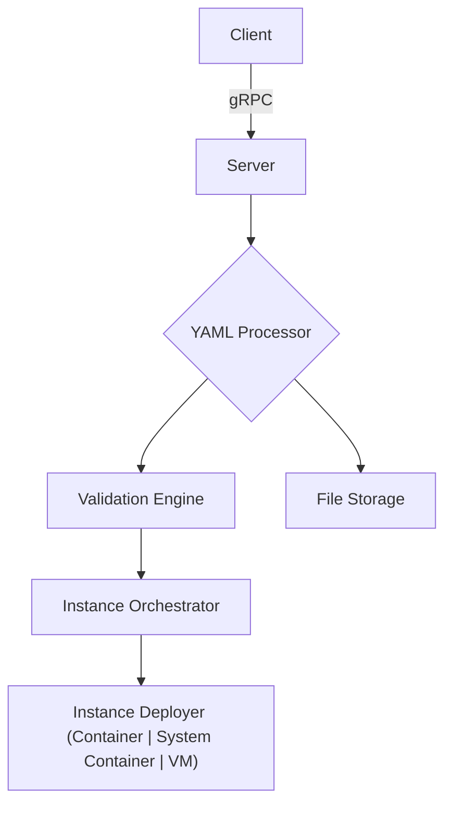

# Developers' Manual

A comprehensive guide for contributing to and extending the MECO emulator system.

---

## Table of Contents

- [API Architecture](#architecture)
- [Codebase Organization](#codebase-organization)
- [Infrastructure Abstraction](#infra-abstraction)
- [Development Environment Setup](#dev-setup)
- [Development Workflow](#development-workflow)
- [Protobuf & gRPC](#protobuf-grpc)
- [Logging & Monitoring](#logging)
- [Testing Strategies](#testing)
- [Contribution Guidelines](#contribution)
- [Future Roadmap](#future)

---

## API Architecture <a id="architecture"></a>

### Core Components Diagram



### gRPC Service Definition (`meco.proto`)

```protobuf
syntax = "proto3";

package meco;
import "google/protobuf/empty.proto";

// Define the gRPC service
service MecoService {
  // Start processing and Emulation (Supporting either a filename or inline file content)
  rpc Start (ResourceDescriptor) returns (stream StartResponse);

  // Existing RPC
  rpc MecoCall (MecoRequest) returns (MecoResponse);

  // Shutdown an ongoing emulation
  rpc Shutdown(google.protobuf.Empty) returns (stream ShutdownResponse);
}

// Messages for MecoCall
message MecoRequest {
  string message = 1;
}

message MecoResponse {
  string message = 1;
}

// Message used by the Start RPC
message ResourceDescriptor {
  oneof file_data {
    string server_file_path = 1;    // File that already exists on the server
    string client_file_content = 2; // // File content sent from the client
  }
  optional string save_as = 3; // Save on the server and start the testbed
  optional bool dry_run = 4;   // Save file without starting the testbed
}

// Response from the Start RPC
message StartResponse {
  bool success = 1;
  string message = 2;
  string log_message = 3;
}

message ShutdownResponse {
  bool success = 1;
  string message = 2;
  string log_message = 3;
}
```

### Key Architectural Features

#### Server-Side Components

- **YAML Validation Pipeline**:
  - Syntax validation using PyYAML
  - Semantic validation (minimum node requirements)
  - Dependency resolution check
- **Resource Management**:
  - PID-based process tracking
  - Graceful shutdown sequence
  - File versioning in `/tmp/meco_uploads`
- **gRPC Interface**:
  - Thread-pooled request handling
  - Structured error propagation
- **Instance Orchestrator** (formerly Execution Engine):
  - Determines deployment mode for each node based on its type (e.g., Satellite → app container, Router → system container, NetworkOrchestrator → VM)
  - Uses `incus launch` with `--vm` flag for VMs, or standard container launch for others
  - Maintains a registry of all active instances (containers and VMs)

#### Client-Side Components

- **Configuration Management**:
  - Interactive Nano editor integration
  - File diffing for version comparisons
  - Batch processing support
- **Connection Management**:
  - Automatic retry logic
  - Timeout handling
  - TLS support (future)
- **Instance Cleanup Logic**:
  - The client automatically deletes both containers and VMs associated with MECO deployments (not just containers)

---

## Codebase Organization <a id="codebase-organization"></a>

The project is structured into modular components to separate concerns and improve maintainability:

| Package | Purpose |
| :--- | :--- |
| **`src/`** | **Source Root**. Contains the `meco` package. |
| **`src/meco/`** | **Package Root**. The main python package. |
| **`src/meco/main.py`** | **Entry Point**. Daemon logic, signal handling, and CLI argument parsing (server-side). |
| **`src/meco/client.py`** | **Client Logic**. Python logic for client CLI operation. |
| **`src/meco/emulation/`** | **Core Logic**. Handles the lifecycle of emulations (`lifecycle.py`), node scheduling, and cloud-init generation (`generator.py`). |
| **`src/meco/network/`** | **Network Layer**. Manages OVS bridges, flow rules (`manager.py`), and localized network setup on hypervisors. |
| **`src/meco/service/`** | **RPC Interface**. Implements the gRPC server (`server.py`) and holds the compiled protobuf stubs. |
| **`src/meco/infra/`** | **Hardware Abstraction**. Provides `IncusClient` and executors (`local`, `ssh`) to interact with hypervisors transparently. |
| **`src/meco/config/`** | **Configuration**. Handles YAML loading, schema validation (`loader.py`), and default settings. |
| **`src/meco/utils/`** | **Utilities**. Logging setup, helper functions, and shared tools. |
| **`topologies/`** | **Topologies**. Contains YAML topology examples. |

---

## Infrastructure Abstraction <a id="infra-abstraction"></a>

MECO runs on a distributed set of hypervisors but manages them as a unified resource. This is achieved through the **Infrastructure Abstraction Layer** located in `infra/`.

### The Executor Pattern

The system uses the **Strategy Pattern** to decouple *what* command to run from *where* to run it.

- **`CommandExecutor` (ABC)**: Defines the interface for running commands and uploading files.
- **`LocalExecutor`**: Uses python's `subprocess` to run commands on the local machine.
- **`SshExecutor`**: Wraps commands to execute on a remote host via SSH.

#### SSH Optimization
The `SshExecutor` is highly optimized for performance and reliability:
- **Multiplexing**: Uses `ControlMaster` and `ControlPersist` to reuse a single SSH connection for multiple commands, eliminating handshake overhead.
- **Non-blocking**: Supports background execution (`-f`) for fire-and-forget tasks like launching instances.
- **Batch Mode**: Disables interactive prompts to prevent hanging on automation.

### Incus Client Wrapper

The `IncusClient` is a high-level wrapper around the `incus` CLI. It requires an `executor` at initialization:

```python
# Initializing for local use
local_client = IncusClient(executor=LocalExecutor())

# Initializing for remote use
ssh_executor = SshExecutor(host="10.0.0.5", user="ubuntu")
remote_client = IncusClient(executor=ssh_executor)
```

Methods in `IncusClient` (e.g., `launch_instance`, `create_network`) simply build the appropriate `incus` command lists and pass them to `self.executor.run()`. This ensures that the core logic in `LifecycleManager` remains identical whether deploying to `localhost` or a remote cluster.

---

## Development Environment Setup <a id="dev-setup"></a>

### 1. Clone the Repository

```bash
git clone https://github.com/netgroup/meco-devel.git
cd meco-devel
```

### 2. Python Virtual Environment

```bash
python3 -m venv venv
source venv/bin/activate
```

### 3. Install Dependencies

```bash
pip install -r requirements.txt
pip install -e .  # Install the package in editable mode (Critical for finding the 'meco' module)
pip install pytest black ruff  # Install development tools
```

### 4. Compile Protobuf/gRPC Stubs

```bash
python -m grpc_tools.protoc -I. --python_out=. --grpc_python_out=. src/meco/meco.proto
```

### 5. (Optional) Enable CLI Auto-completion

```bash
eval "$(register-python-argcomplete meco)"
eval "$(register-python-argcomplete client)"
```

### 6. Incus Setup (for local emulation)

- Ensure Incus is installed and initialized (see main README).
- Add your user to the `incus-admin` group and re-login.
- For VM support, ensure `qemu-system` is installed on your system.

---

## Development Workflow <a id="development-workflow"></a>

### Making Code Changes

1. **Create a Feature Branch**

   ```bash
   git checkout -b feature/my-feature
   ```

2. **Edit Code**

   - Update Python modules in `src/meco/meco.py`, `src/meco/client.py`, etc.
   - If you change the gRPC interface, update `src/meco/meco.proto` and recompile stubs.

3. **Format and Lint**

   ```bash
   black .
   ruff .
   ```

4. **Run Tests**

   ```bash
   pytest tests/ -v
   ```

5. **Commit and Push**

   ```bash
   git add .
   git commit -m "Describe your change"
   git push origin feature/my-feature
   ```

6. **Open a Pull Request**

   - Follow the contribution guidelines for PRs.

---

## Protobuf & gRPC <a id="protobuf-grpc"></a>

- Edit `meco.proto` to change the API.
- Recompile stubs after changes:

  ```bash
  python -m grpc_tools.protoc -I. --python_out=. --grpc_python_out=. src/meco/meco.proto
  ```

- Update both server (`meco.py`) and client as needed.

---

## Logging & Monitoring <a id="logging"></a>

### Log Structure

```python
{
  "timestamp": "YYYY-MM-DD HH:MM:SS",
  "component": "server|client",
  "level": "INFO|WARN|ERROR",
  "operation": "Start|Validate|Persist",
  "instance_type": "container|vm",  # Use this field for clarity in future logs
  "duration_ms": 45,
  "message": "Descriptive message",
  "metadata": {}
}
```

### Viewing Logs

```bash
tail -f /tmp/meco_server.log | jq
tail -f /tmp/meco_client.log | jq
```

---

## Testing Strategies <a id="testing"></a>

### 1. Unit Tests

- Located in `tests/`
- Run with:

  ```bash
  pytest tests/ -v
  ```
- Ensure both container and VM deployment paths are tested:
  - Use a YAML sample for container-only deployment (e.g., `topologies/containers_only.yaml`)
  - Use a YAML sample with mixed container and VM roles (e.g., `topologies/with_vm.yaml`)
  - Example VM test:
    ```bash
    client start --filepath topologies/with_vm.yaml
    ```

### 2. Manual Testing

- Start the server:

  ```bash
  meco on
  ```

- Deploy a topology  
  ```bash
  client start --filepath topologies/example.yaml --dryrun
  ```

- Check status:

  ```bash
  meco status
  # Output now lists both containers and VMs under active instances
  ```

- Shutdown:

  ```bash
  client shutdown
  ```

### 3. Debugging

- Server introspection:

  ```bash
  meco status
  # Shows all active containers and VMs
  ```

- gRPC debugging:

  ```bash
  GRPC_VERBOSITY=DEBUG GRPC_TRACE=all meco on
  ```

---

## Contribution Guidelines <a id="contribution"></a>

- Fork the repository and create a feature branch from `main`.
- Keep commits atomic and descriptive.
- Rebase before merging.
- Run all tests and linters before submitting a PR.
- Squash merge for features.
- If modifying deployment logic, ensure VM/container compatibility is preserved.

---

## Future Roadmap <a id="future"></a>

- [ ] TLS support for gRPC
- [ ] Adding Benchmarks

---

**For any questions or support, open a GitHub issue or contact the maintainers.**