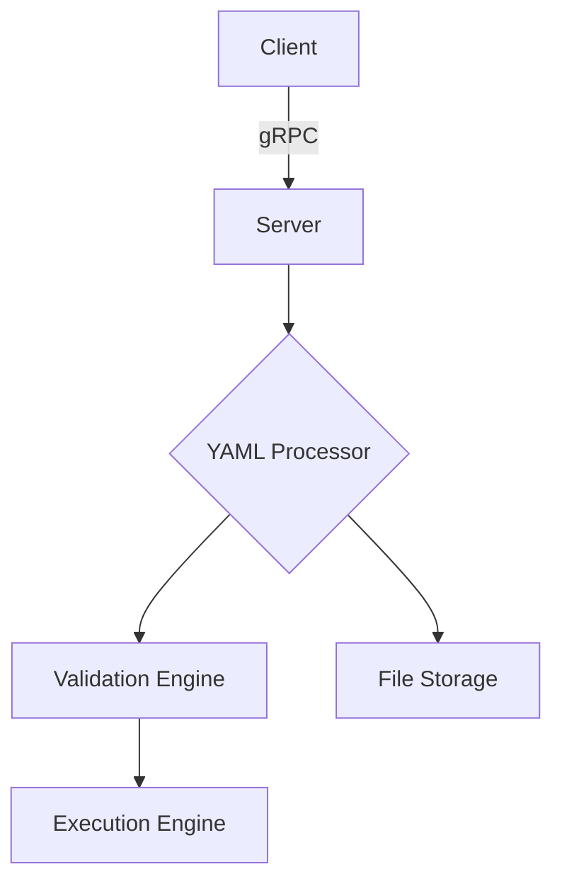
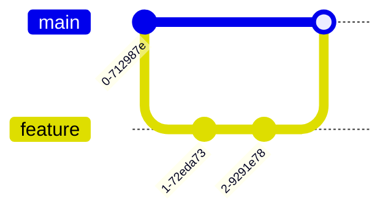

# Developers' Manual

A comprehensive guide for contributing to and extending the MECO emulator system.

---

## Table of Contents

- [API Architecture](#architecture)
- [Development Workflow](#development-workflow)
- [Logging & Monitoring](#logging)
- [Testing Strategies](#testing)
- [Contribution Guidelines](#contribution)
- [Future Roadmap](#future)

---

## API Architecture <a id="architecture"></a>

### Core Components Diagram



### gRPC Service Definition (`meco.proto`)

```protobuf
syntax = "proto3";

service MecoService {
  // Diagnostic echo endpoint
  rpc MecoCall(MecoRequest) returns (MecoResponse);
  
  // Main configuration endpoint
  rpc Start(ResourceDescriptor) returns (StartResponse);
}

message ResourceDescriptor {
  oneof file_data {
    string server_file_path = 1;    // Path to existing server-side file
    string client_file_content = 2; // Direct YAML content payload
  }
  optional string save_as = 3;      // Server-side persistence name
  optional bool dry_run = 4;        // Validation-only mode flag
}

message StartResponse {
  bool success = 1;
  string message = 2;
}
```

### Key Architectural Features

#### Server-Side Components

- **YAML Validation Pipeline**:
  - Syntax validation using PyYAML
  - Semantic validation (minimum node requirements)
  - Dependency resolution check
- **Resource Management**:
  - PID-based process tracking
  - Graceful shutdown sequence
  - File versioning in `/tmp/meco_uploads`
- **gRPC Interface**:
  - Thread-pooled request handling
  - Structured error propagation

#### Client-Side Components

- **Configuration Management**:
  - Interactive Nano editor integration
  - File diffing for version comparisons
  - Batch processing support
- **Connection Management**:
  - Automatic retry logic
  - Timeout handling
  - TLS support (future)

---

## Development Workflow <a id="development-workflow"></a>

### Environment Setup

1. **Clone Repository**:

   ```bash
   git clone https://github.com/netgroup/meco-devel
   cd meco-devel
   ```

2. **Virtual Environment**:

   ```bash
   python -m venv .venv
   source .venv/bin/activate  # Linux/macOS
   # .venv\Scripts\activate  # Windows
   ```

3. **Install Dependencies**:

   ```bash
   pip install -r requirements-dev.txt  # Includes development tools
   ```

4. **Protobuf Compilation**:

   ```bash
   python -m grpc_tools.protoc -I. --python_out=. --grpc_python_out=. meco.proto
   ```

### Modification Workflow

1. **Protocol Buffers Changes**:
   - Modify `meco.proto`
   - Regenerate stubs
   - Update service implementations in `meco.py` and `meco_test_client.py`

2. **Testing Cycle**:

   ```bash
   # Start server in test mode
   meco on --test-mode
   
   # Run integration tests
   pytest tests/ -v
   
   # Manual test
   client start --filepath samples/basic_config.yaml --dryrun
   ```

3. **Debugging Tools**:
   - Server introspection:

     ```bash
     meco status  # Shows active connections
     ```

   - gRPC debugging:

     ```bash
     GRPC_VERBOSITY=DEBUG GRPC_TRACE=all meco on
     ```

---

## Logging & Monitoring <a id="logging"></a>

### Log Structure

```python
{
  "timestamp": "2025-02-07 12:00:00",
  "component": "server|client",
  "level": "INFO|WARN|ERROR",
  "operation": "Start|Validate|Persist",
  "duration_ms": 45,
  "message": "Descriptive message",
  "metadata": {}  # Context-specific data
}
```

### Monitoring Tools

1. **Real-time Logs**:

   ```bash
   # Server logs
   tail -f /tmp/meco_server.log | jq  # Requires jq for pretty-printing
   
   # Client logs
   watch -n 1 cat /tmp/meco_client.log
   ```

2. **Metrics Collection** (Future):

   ```bash
   # Prometheus endpoint (planned)
   curl localhost:9090/metrics
   ```

---

## Testing Strategies <a id="testing"></a>

### Test Types

1. **Unit Tests**:
   - Validation logic
   - File operations

   ```bash
   pytest tests/unit -v
   ```

2. **Integration Tests**:
   - gRPC communication
   - Client-server interaction

   ```bash
   pytest tests/integration -v
   ```

3. **Performance Tests**:

   ```bash
   # Benchmark tool (example)
   meco-bench --connections 100 --duration 30s
   ```

---

## Contribution Guidelines <a id="contribution"></a>

### Branch Strategy



**Workflow**:

- Create feature branch from `main`
- Keep commits atomic
- Rebase before merging
- Squash merge for features

---

## Future Features <a id="future"></a>

- [ ] Docker/Kubernetes deployment
- [ ] TLS support for gRPC
- [ ] Add unit tests for CLI and gRPC services
