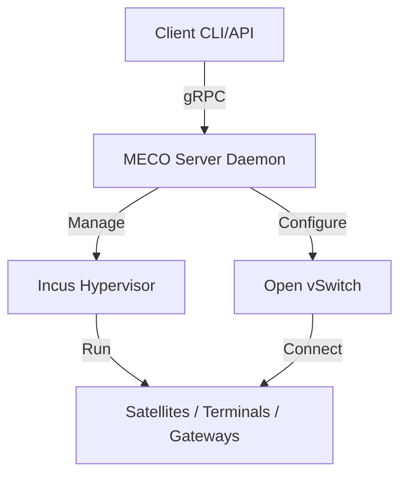

# MECO - MEga COnstellation Emulator

[](https://opensource.org/licenses/Apache-2.0)

MECO is a scalable, distributed emulator designed for LEO (Low Earth Orbit) mega-constellation networks. It enables researchers and developers to simulate complex satellite networks with high fidelity, supporting real-time control and hybrid deployment of lightweight application containers, system containers, and virtual machines.

---

## Table of Contents

1. [Key Features](#key-features)
2. [Architecture](#architecture)
3. [Prerequisites](#prerequisites)
4. [Installation](#installation)
5. [Quick Start](#quick-start)
6. [Configuration Guide](#configuration-guide)
7. [Distributed Emulation](#distributed-emulation)
8. [Command Reference](#command-reference)
9. [Troubleshooting](#troubleshooting)
10. [Contributing](#contributing)
11. [License](#license)

---

## 1. Key Features <a id="key-features"></a>

-   **Hybrid Node Support**: Seamlessly mix lightweight **App Containers** (processes), full **System Containers** (services/routing), and **VMs** (kernels) in a single topology.
-   **Distributed Emulation**: Scale beyond a single machine by distributing nodes across multiple physical hypervisors.
-   **Dynamic Topology**: Define orbits, satellites, and ground stations using flexible YAML configurations.
-   **Real-time Control**: Interact with the emulation via a gRPC API (Port 50051) for dynamic rule updates and monitoring.
-   **High-Fidelity Networking**: Built on **Open vSwitch (OVS)** to model realistic delays, bandwidth constraints, and packet loss.
-   **Parallel Deployment**: Configurable thread pools for fast spin-up of large-scale networks.

---

## 2. Architecture <a id="architecture"></a>

MECO follows a client-server architecture designed for scalability and modularity.



### Node Types

MECO automatically maps generic node types to specific Incus resources for optimal resource usage:

| Node Type | Underlying Tech | Use Case | Example |
| :--- | :--- | :--- | :--- |
| **App Container** | Process Container | Lightweight apps, simple forwarding | `Satellite`, `Terminal` |
| **System Container** | Full OS Container | Complex routing, background services | `Router`, `Gateway` |
| **VM** | Virtual Machine | Custom kernels, heavy isolation | `NetworkOrchestrator` |

---

## 3. Prerequisites <a id="prerequisites"></a>

Ensure your environment meets these requirements before installation:

| Requirement | Version | Notes |
| :--- | :--- | :--- |
| **OS** | Ubuntu 22.04 / 24.04 LTS | Recommended for native Incus support. |
| **Python** | 3.10+ | Required for server and client. |
| **Incus** | 6.16+ | **Critical dependency** for container/VM management. |

**Dependencies**: Open vSwitch, `btrfs-progs` (if using Btrfs storage), `iproute2`.

---

## 4. Installation <a id="installation"></a>

### 4.1. Install Incus

Incus is the core hypervisor manager.

**For Ubuntu 24.04+:**
```bash
sudo apt update
sudo apt install incus qemu-system incus-tools
```

**For Ubuntu 20.04/22.04:**
Follow the official [Zabbly repository instructions](https://github.com/zabbly/incus) to get the latest stable version.

**Initialize Incus:**
```bash
# Add user to admin group
sudo usermod -aG incus-admin $USER
newgrp incus-admin

# Initialize (Default settings are usually fine)
incus admin init
```

### 4.2. Install MECO

Clone the repository and set up the Python environment:

```bash
git clone https://github.com/netgroup/meco-devel.git
cd meco-devel

# Create and activate virtual environment
python3 -m venv venv
source venv/bin/activate

# Install Python dependencies
pip install -r requirements.txt

# Compile gRPC definitions
python -m grpc_tools.protoc -I. --python_out=. --grpc_python_out=. src/meco/meco.proto
```

### 4.3. Setup Wrapper Scripts

Create symlinks to run `meco` and `client` commands globally:

```bash
sudo ln -s $PWD/meco-cli /usr/local/bin/meco
sudo ln -s $PWD/client /usr/local/bin/client
sudo chmod +x /usr/local/bin/meco /usr/local/bin/client
```

---

## 5. Quick Start <a id="quick-start"></a>

1.  **Start the Server**:
    ```bash
    meco on
    ```

2.  **Deploy a Topology**:
    ```bash
    # Verify your topology schema first
    client start --filepath topologies/testbed1.yaml --dryrun

    # Deploy the topology
    client start --filepath topologies/testbed1.yaml
    ```

3.  **Check Status**:
    ```bash
    meco status
    ```

4.  **Monitor Logs**:
    ```bash
    meco logs   # or tail -f /tmp/meco_server.log
    ```

5.  **Teardown**:
    ```bash
    client shutdown
    ```

6.  **Stop Server**:
    ```bash
    meco off
    ```

---

## 6. Configuration Guide <a id="configuration-guide"></a>

MECO is configured via two main files: the **Topology** (per emulation) and the **Server Config** (global).

### 6.1. Topology Configuration (`topology.yaml`)

Defines the network graph, including nodes, links, and visibility windows.

```yaml
topology:
  orbital-plane: 1

node-types:
  - type: Satellite
    properties:
      image: "satellite.img"

nodes:
  - id: 0
    type: Satellite
    latitude: 0.0
    longitude: 0.0

visibility-ground:
  - time: 0
    connection:
      - source: 1
        destination: 0
        bandwidth: 50
```

### 6.2. Server Configuration (`src/meco/config/config.yaml`)

Controls global settings and distributed mapping.

```yaml
defaults:
  integration_bridge: "br-int"
  tunnel_bridge: "br-tun"
  storage_pool: "default"
  image_container: "images:ubuntu/22.04"

hypervisors:
  hv1:
    ip: "10.55.0.186"
    instances:
      - "1-Satellite"  # Pinned instance
  hv2:
    ip: "10.55.0.225"
    instances: []      # Available for dynamic scheduling
```

---

## 7. Distributed Emulation <a id="distributed-emulation"></a>

MECO transparently supports running instances across multiple physical machines.

1.  **Prepare Remote Nodes**:
    -   Install Incus and MECO dependencies on all worker nodes.
    -   Ensure SSH access from the master node to workers (preferably key-based).

2.  **Configure `config.yaml`**:
    -   Add each worker under the `hypervisors` section.
    -   Specify their IP addresses.

3.  **Run**:
    -   The `meco` server on the master node orchestrates deployment.
    -   Bridges (`br-int`, `br-tun`) and VXLAN tunnels are automatically created to link nodes across hypervisors.

---

## 8. Command Reference <a id="command-reference"></a>

### Server CLI (`meco`)

| Command | Description |
| :--- | :--- |
| `meco on` | Starts the MECO daemon (background process). |
| `meco off` | Stops the daemon. Use `-f` to force clean active emulations. |
| `meco status` | Checks if the server is running and lists active PIDs. |
| `meco logs` | Tails the server logs. |

### Client CLI (`client`)

| Command | Flag | Description |
| :--- | :--- | :--- |
| `client start` | `--filepath <file>` | Load and deploy a local YAML topology. |
| | `--filename <name>` | Deploy a file already present on the server. |
| | `--dryrun` | Validate the topology schema without deploying. |
| | `--saveas <name>` | Save the uploaded configuration on the server. |
| `client shutdown` | | Gracefully stop the current emulation and clean up resources. |
| `client logs` | | View the client logs. |

---

## 9. Troubleshooting <a id="troubleshooting"></a>

-   **"Port map empty"**: Usually means instances didn't start correctly or failed to report their network interfaces. Check `meco logs`.
-   **"Address already in use"**: The gRPC port (50051) is taken. Check for zombie python processes (`ps aux | grep main.py`) or old meco instances.
-   **Incus permissions**: Ensure your user is in the `incus-admin` group and you have re-logged in.
-   **Leftover Resources**: If a crash occurs, use `meco off -f` to force cleanup, or manually remove instances with `incus delete <name> --force`.

---

## 10. Contributing <a id="contributing"></a>

We welcome contributions! Please see [Development.md](Development.md) for detailed guidelines on:

-   Code Style & Linting
-   Running Tests
-   Submitting Pull Requests

## 11. License <a id="license"></a>

This project is licensed under the **Apache 2.0 License**.