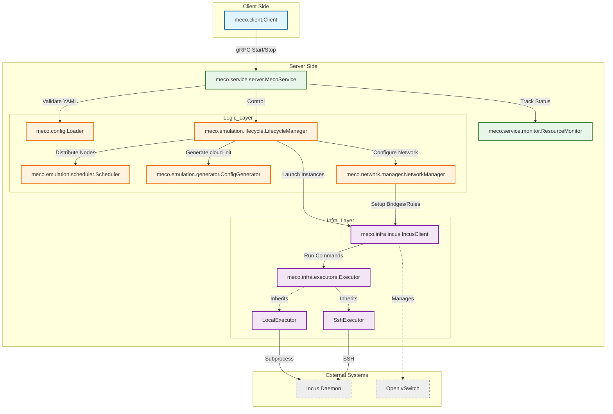

# System Architecture Diagram

This diagram illustrates the component interactions within the MECO system, detailing the flow from the Client CLI down to the low-level infrastructure execution.

```mermaid
graph TD
    %% Styling
    classDef client fill:#e1f5fe,stroke:#01579b,stroke-width:2px;
    classDef service fill:#e8f5e9,stroke:#2e7d32,stroke-width:2px;
    classDef core fill:#fff3e0,stroke:#ef6c00,stroke-width:2px;
    classDef infra fill:#f3e5f5,stroke:#7b1fa2,stroke-width:2px;
    classDef ext fill:#eeeeee,stroke:#616161,stroke-width:1px,stroke-dasharray: 5 5;

    subgraph Client_Side [Client Side]
        CLI[meco.client.Client]:::client
    end

    subgraph Server_Side [Server Side]
        direction TB
        GRPC[meco.service.server.MecoService]:::service
        Monitor[meco.service.monitor.ResourceMonitor]:::service
        
        subgraph Logic_Layer
            Loader[meco.config.Loader]:::core
            Lifecycle[meco.emulation.lifecycle.LifecycleManager]:::core
            Scheduler[meco.emulation.scheduler.Scheduler]:::core
            Generator[meco.emulation.generator.ConfigGenerator]:::core
            NetMgr[meco.network.manager.NetworkManager]:::core
        end
        
        subgraph Infra_Layer
            Incus[meco.infra.incus.IncusClient]:::infra
            Exec[meco.infra.executors.Executor]:::infra
            LocalExec[LocalExecutor]:::infra
            SshExec[SshExecutor]:::infra
        end
    end

    subgraph External_Systems [External Systems]
        IncusDaemon[Incus Daemon]:::ext
        OVS[Open vSwitch]:::ext
    end

    %% Relationships
    CLI -->|gRPC Start/Stop| GRPC
    
    GRPC -->|Validate YAML| Loader
    GRPC -->|Control| Lifecycle
    GRPC -->|Track Status| Monitor
    
    Lifecycle -->|Distribute Nodes| Scheduler
    Lifecycle -->|Generate cloud-init| Generator
    Lifecycle -->|Configure Network| NetMgr
    Lifecycle -->|Launch Instances| Incus
    
    NetMgr -->|Setup Bridges/Rules| Incus
    
    Incus -->|Run Commands| Exec
    
    Exec -.->|Inherits| LocalExec
    Exec -.->|Inherits| SshExec
    
    LocalExec -->|Subprocess| IncusDaemon
    SshExec -->|SSH| IncusDaemon
    
    Incus -.->|Manages| OVS
```
